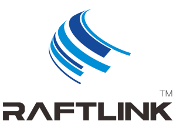

# RaftLink JavaScript 编程指南


  
###### Guangzhou Fuhai Software Technology Co., Ltd.
###### 广州市孚海软件技术有限公司 出品
[Company website http://www.wifi-town.com](https://www.wifi-town.com/)


#### Histroy
|Version|Revision|Author|Date|
|:----- |:-------|:-----|----- |
|v1.0 |First initial version|Easion|2019-08-08 |


> 提示
**本文档编写尚未完成,处于持续更新状态，敬请期待**


## 1. 概论
  [RaftLink](https://raftlink.1688.com/)是广州市孚海软件技术有限公司的注册商标。该产品主要用作路由器/物联网/智能家居用途。支持小程序、天猫精灵远程控制，提供面板、运行ZIGBEE网关、HOMEKIT、在线视频等功能，并提供二次开发API接口。
  
  [QuickJS Javascript Engine](https://bellard.org/quickjs)是FFmpeg和QEMU的创建者Fabrice Bellard开发的约4.7万行代码实现的JavaScript引擎，详情请见上面网页的《Introduction》章节。
  
[QuickJS 官方文档在此](https://bellard.org/quickjs/quickjs.html)
[RaftLink设备购买地址](https://raftlink.1688.com/)
 
下面是我们对该软件的修改:
  - 融入RaftLink软件通讯框架，仍然保存单进程运行架构。
  - 提供UI给用户配置运行参数。
  - 提供接口给用户上传脚本和配置。
  - 提供API让用户可以创建自己的WEB节点。
  - 更全面的libc的封装API，如socket等。
  - 作为输入端提供设备API给HomeKit网关。
  - NodeJS兼容层，如 Buffer,FS,EventEmitter,jsonfile等模拟API。
  - 提供串口操作API
  - 提供mosquitto，libcurl封装API。
  
 ## 2.软件安装:
  
**连接到RaftLink所在网络，在浏览器输入fuhai.gw或者设备IP地址:**
```mermaid
点击进入：
应用-->> 可安装应用-->>RaftLink Javascript Engine-->展开倒立^-->点击安装按钮
```

## 2. 编程

#### 2.1 编程架构
>下图是软件基本配置页面：.


程序允许用户上传三种脚本，分别是“主程序脚本”，“备份脚本”，“本地保存的配置文件”.

|类型|作用|
|:----- |:------|
|主程序脚本|系统默认运行的脚本文件 |
|备份脚本|主程序脚本不存在或者出现加载错误，即启动备份脚本，可用于灾难恢复、脚本自身升级 |
|本地保存的配置文件|用户上传的配置文件，路径通过全局变量scriptConfigFile访问，如果是json格式，可通过jsonfile进行解析或者保存 |

一个脚本的例子
```js
import * as RaftLink from "raftlink.so";
import * as utils from "../res/utils.js";
import * as homekit from "../res/hap.js";

console.log(`scriptArgs : ${scriptArgs}`);
console.log(`scriptConfigFile : ${scriptConfigFile}`);
```

***定时器API**

```js
var myVar = os.setInterval(function(){ alertFunc("First param", "Second param"); }, 2000);

os.clearInterval(myVar);

var myTimer = os.setTimeout(function(){ alert("Hello"); }, 3000);
os.clearTimeout(myTimer);
```

QJS没有全局的setInterval/setTimeout/clearInterval/clearTimeout，请使用os名字空间的对应函数。


**脚本需使用UTF-8编码，否则包含中文或非ASCII字符会导致加载出错，并删除已经上传的主程序**

#### 2.2 调试
console.log的输出将保存在系统日志中。
查看日志的方式为： 首页点击三横的icon菜单,在右侧的菜单点击“日志”进入，更新日志仅点击底部的刷新按钮即可。

#### 2.2 故障恢复
脚本出错，会在日志中打印出错的堆栈信息，可根据堆栈提示信息进行修改。

#### 2.3 文件访问限制
处于对系统安全的考虑，我们限制了用户对系统敏感文件的访问，JS脚本可以访问的目录包含如下，不支持访问父目录。

```sh
/tmp/： 内存文件系统，容量相对大，重启后会丢失。
/dev/: 设备文件系统，可直接访问设备驱动，如串口、磁盘。
/proc/: 系统信息文件系统
/sys/: 系统调试文件系统。
```


## 3. FAQ
  
####  3.1我的脚本需要导入其他的文件，怎么办？
   可通过curl模块下载js脚本保存到本地，再重启脚本导入。

#### 3.2 fs 模块支持模拟NODEJS的异步API吗
  不支持

#### 3.2 支持ES6的Promise API吗
  是的，支持

#### 3.3 文档不全面，我怎样找到我需要的功能API
  请从本仓库的样例代码查找，如果没有找到的话可以通过底部提供的邮件地址联系开发者。
  
## 4.0 联系开发者
----

```sh
email: root@wifi-town.com
phone: +086-18244944879
```

**Thank you!**


