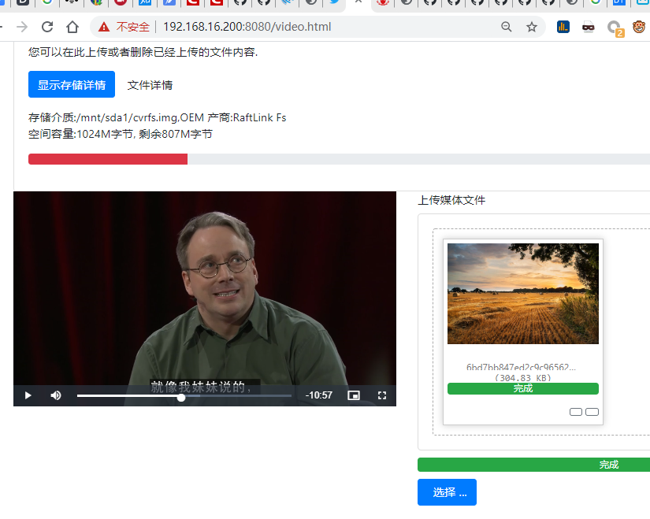
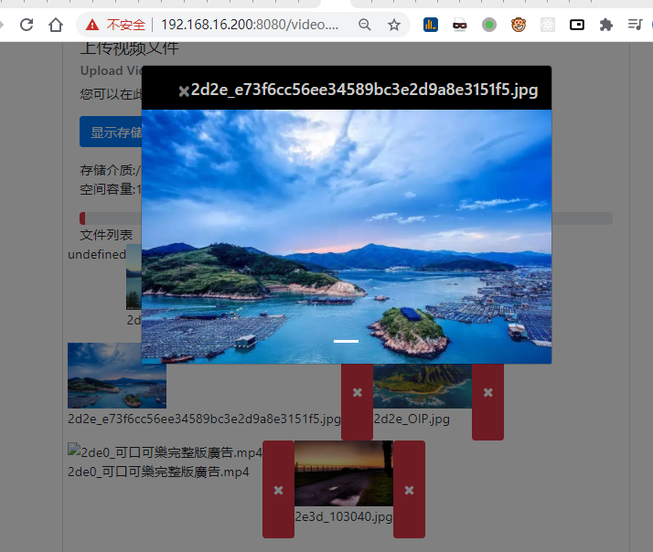

# CVR存储系统设计DEMO说明

#### 版本
| 版本  | 更新说明  | 作者 |
| :------------ |:---------------:| -----:|
| 1.0      | 初始版本 | easion|
|     1.1      |   |        | |

此项目主要是分析CVR直写文件对象和传统文件系统各自特征，分析传统文件系统不能满足大容量存储需求的一些原因，并针对CVR这种场景应用所规划的文件系统框架，因为文件直写是通过一个library来实现的，文档会提供磁盘和内存的关键数据和C语言的API调用接口。

CVR DEMO目前环境使用openwrt/MIPS架构的RaftLink网关开发，以文件系统镜像方式测试,image可通过winhex方便调试，也可支持用磁盘如U盘直接写入。
DEMO目前已经完成了文件系统的创建(makefs)、长文件名功能、文件直写对象的挂载/卸载、目录和文件的创建/删除、目录文件信息的展示、通过内建的webserver来实现文件上传到CVR和下载、以及复制出CVR文件到linux文件系统功能。由于时间关系，只支持到根目录文件访问。

#### DEMO文件说明
 - **api.c**      RaftLink网关内建webserver服务器,注册cvffs的HTTP RestFul API回调。
 - **cvrfs.h**    CVRFS对外接口API函数封装
 - **video.html** 基于bootstrap框架的前端展示接口，通过网页上传文件到cvrfs并存储,通过videojs可播放cvrfs文件以及图片内容，查询CVR直写文件对象的空间使用率。

#### 视频上传/下载测试

视频已经支持定位

#### 图片上传下载测试

视频已经支持定位

DEMO可支持RTSP摄像头存储mp4视频文件到CVR。通过html5播放CVR上的视频文件，目前运行稳定，正在测试中。

